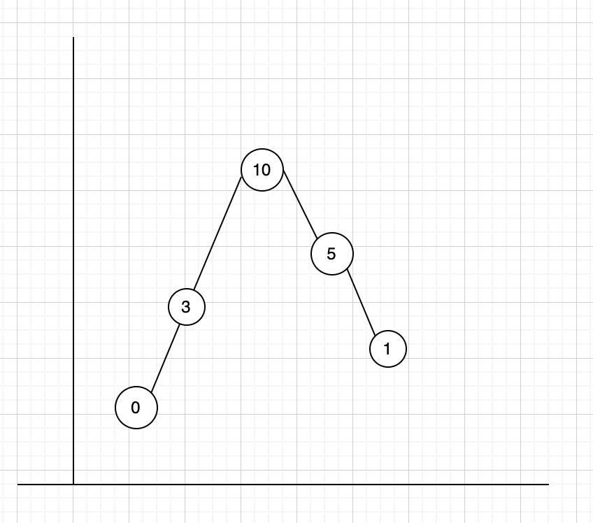
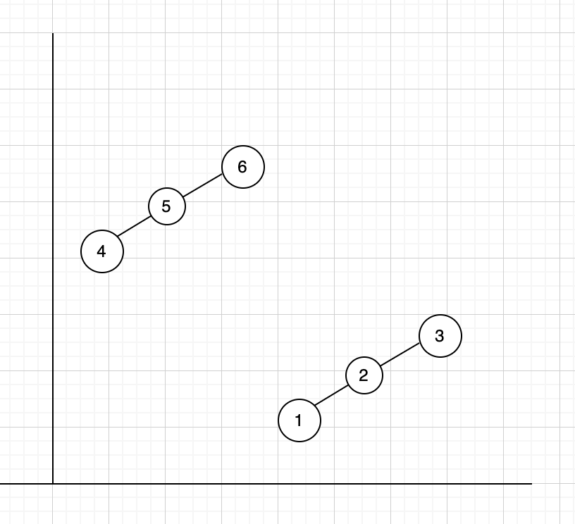
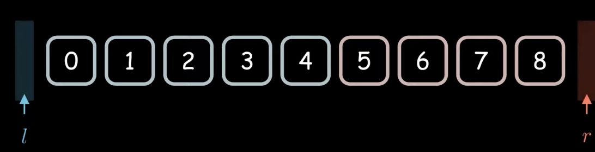
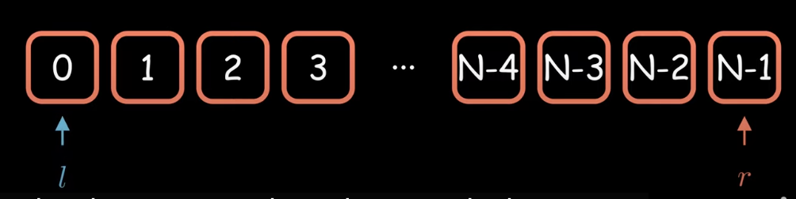
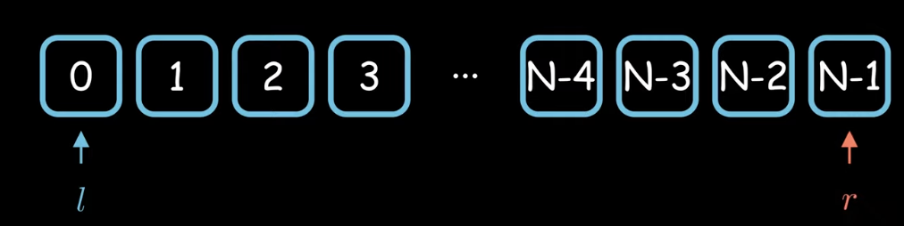
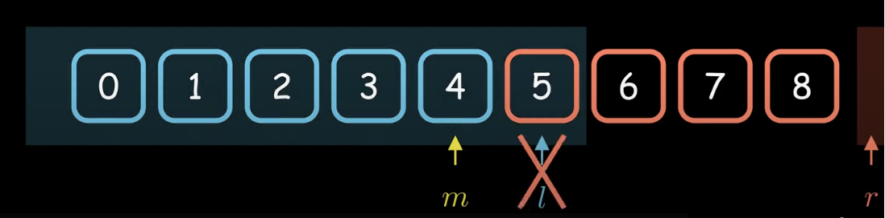
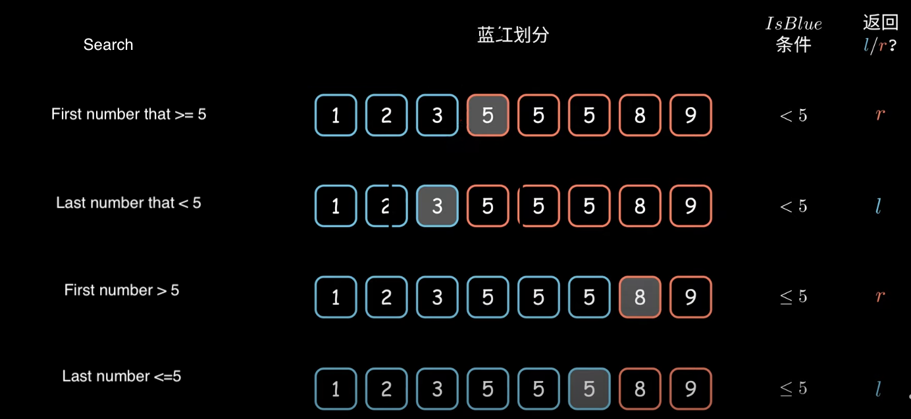

# Binary Search 

### Question Types
#### 1.Blue-Red Problems
* [704. Binary Search](https://leetcode.com/problems/binary-search/)
  * `nums = [-1,0,3,5,9,12], target = 9, output: 4`
* [744. Find Smallest Letter Greater Than Target](https://leetcode.com/problems/find-smallest-letter-greater-than-target/)
  * `letters = ["c","f","j"], target = "a", output: "c"`

#### 2.Two Segments Problems
* [33. Search in Rotated Sorted Array](https://leetcode.com/problems/search-in-rotated-sorted-array/)
* [852. Peak Index in a Mountain Array](https://leetcode.com/problems/peak-index-in-a-mountain-array/)
* [153. Find Minimum in Rotated Sorted Array](https://leetcode.com/problems/find-minimum-in-rotated-sorted-array/)

  

* [34. Find First and Last Position of Element in Sorted Array](https://leetcode.com/problems/find-first-and-last-position-of-element-in-sorted-array/)
* [35. Search Insert Position](https://leetcode.com/problems/search-insert-position/)
* [33. Search in Rotated Sorted Array](https://leetcode.com/problems/search-in-rotated-sorted-array/)


## Blue-Red Solution: Yet Another way of monotonous binary search
_Reference:_    
[二分查找为什么总是写错？(Binary Search Done Right)](https://www.youtube.com/watch?v=JuDAqNyTG4g&t=759s)
(Chinese, Auto-Generate other language)

The algorithm is to maintain the blue and red area.
(Do not cross the border)

__Template:__
```cpp
l = -1,
r = N,
while l+1 != r 
    m = l + (r-l)/2
    if IsBlue(m)         
        l = m
    else                
        r = m

return l or r                
```

#### Q1: why not init `l=0, r=N-1`? 

No, you cannot init l as 0, and r as N-1. 
In the implementation, if l start from 0, meaning all the numbers are in red area
Similar, if r=N-1, meaning, all the area is blue. 




#### Q2: Can I wirte `l=m+1` or `m=r-1`?
No. Consider about the correctness and understandability. 
In the algorithm, we keep blue and red area, don't let it cross. 




#### Examples:


