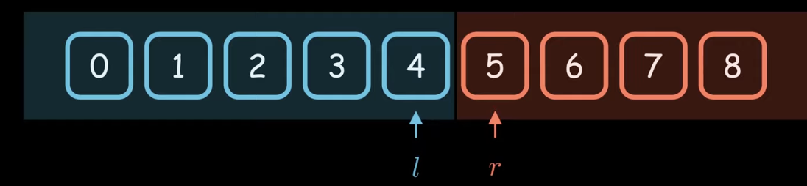

# Binary Search

reference:
[二分查找为什么总是写错？](https://www.youtube.com/watch?v=JuDAqNyTG4g&t=759s)
(Chinese, English subtitle)


```cpp
l = -1,
r = N,
while l+1 != r 
    m = l + (r-l)/2
    if IsBlue(m)         
        l = m
    else                
        r = m

return l or r                
```

### Question 1: why not init `l=0, r=N-1`? 

No, you cannot init l as 0, and r as N-1. 
In the implementation, if l start from 0, meaning all the numbers are in red area
Similar, if r=N-1, meaning, all the area is blue. 


### Question 2: Can I wirte `l=m+1` or `m=r-1`?
No. Consider about the correctness and understandability. 
In the algorithm, we keep blue and red area, don't let it cross. 





### Examples:


### Exercise
#### Basic
1. 704

#### Medium 
* [34. Find First and Last Position of Element in Sorted Array](https://leetcode.com/problems/find-first-and-last-position-of-element-in-sorted-array/)
* [35. Search Insert Position](https://leetcode.com/problems/search-insert-position/)
* [33. Search in Rotated Sorted Array](https://leetcode.com/problems/search-in-rotated-sorted-array/)

#### Advanced 
